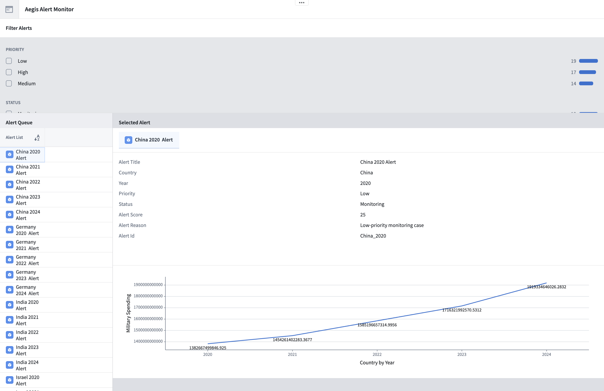
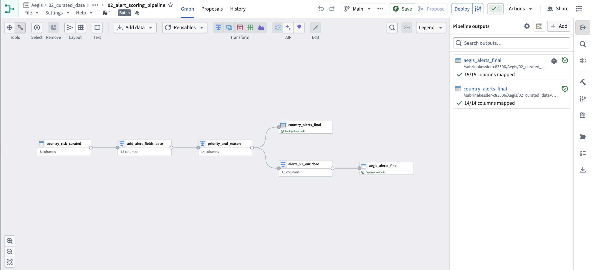
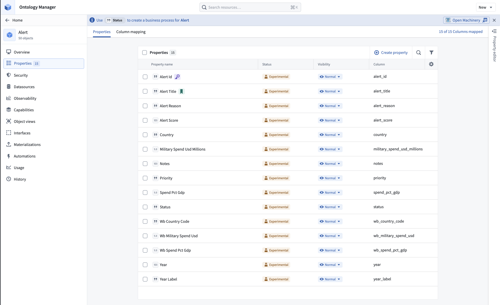
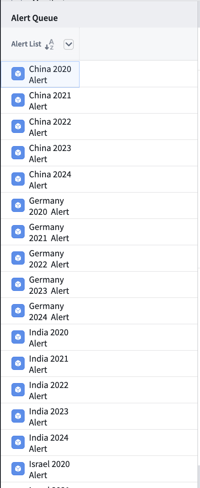
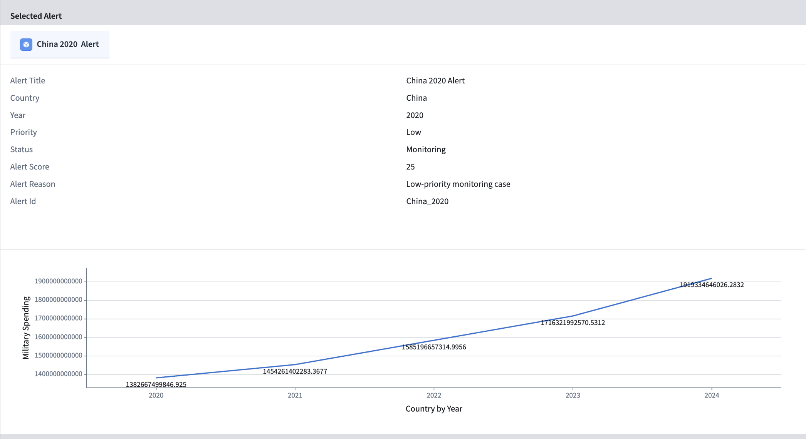

# Aegis: Defense Intelligence Alert Monitor

Aegis is an ontology-backed defense intelligence alert monitor built with Palantir Foundry and Workshop. The project transforms public military-spending data into country-level alert records so analysts can quickly review, filter, and understand potential defense-spending shifts.

This repository documents my Aegis v1 build for the Palantir Build Challenge, including the project purpose, data pipeline, ontology design, Workshop app structure, screenshots, sample alert data, and future roadmap.

---

## Project Overview

Aegis v1 is a lightweight analyst workflow for monitoring defense-spending alerts by country.

The goal is to move from raw public data to a cleaner operational interface where a user can:

- Review defense-spending alerts
- Filter alerts by priority, status, country, and year
- Select an alert from an alert queue
- View key alert details in a dedicated panel
- Understand why an alert was generated

Instead of being only a dashboard, Aegis is designed to feel like a small operational watchfloor for country-level defense monitoring.

---

## Built With

- Palantir Foundry
- Palantir Ontology
- Palantir Workshop
- SIPRI military-spending data
- World Bank military-spending indicators

---

## Data Sources

Aegis v1 uses public military-spending data from two main sources:

### SIPRI

SIPRI military-spending data was used as a core source for country-level defense spending by year.

### World Bank

World Bank military-spending indicators were used as an additional public source for country-level spending comparison and enrichment.

These sources were cleaned, joined, and transformed in Foundry into alert-ready datasets.

---

## Data Pipeline

The Foundry pipeline starts with public military-spending data and produces a final alert dataset used by the Workshop app.

Main datasets:

| Dataset | Purpose |
|---|---|
| `country_risk_curated` | Cleaned and joined country-level spending/risk dataset |
| `country_alerts_final` | Final dataset containing generated alert records |

The final alert dataset includes fields such as:

| Field | Description |
|---|---|
| `alert_id` | Unique identifier for each alert |
| `alert_title` | Short title describing the alert |
| `alert_score` | Numeric score used to rank alert significance |
| `priority` | Alert priority level |
| `status` | Review status of the alert |
| `alert_reason` | Explanation of why the alert was generated |
| `country` | Country associated with the alert |
| `year` | Year associated with the spending signal |

---

## Ontology Design

The main ontology object type is:

### `Alert`

Each `Alert` object represents a country-level defense-spending alert.

The ontology allows the Workshop app to behave more like an operational tool instead of a static dashboard. Users can select alerts, inspect details, filter records, and review key information connected to each alert object.

---

## Workshop App

The Aegis Workshop app is organized around a simple analyst workflow.

### App Layout

| Section | Purpose |
|---|---|
| Top Filters | Filter alerts by fields such as country, year, priority, and status |
| Left Panel | Alert List / Alert Queue |
| Right Panel | Alert Details for the selected alert |

### Core Features

- Alert queue for reviewing generated alerts
- Filters for narrowing the alert list
- Alert details panel for deeper review
- Priority and status fields for triage
- Alert reasons to explain why each record matters

---

## Screenshots

### Workshop App

### Foundry Pipeline

### Ontology Alert Object

### Alert List

### Alert Details

---

## Sample Data

This repository includes a small sample dataset to show the structure of the final alert records.

Files:

- `sample_data/country_alerts_sample.csv`
- `sample_data/data_dictionary.csv`

The sample data is included for portfolio and documentation purposes. The full application was built in Palantir Foundry and Workshop.

---

## Demo Video

Demo video:

[Add demo video link here]

---

## Aegis v1

Aegis v1 focuses on the core MVP:

- Ingest public defense-spending data
- Transform the data in Foundry
- Create alert records
- Model alerts as ontology-backed objects
- Build a Workshop interface for filtering and reviewing alerts

This version proves the core idea: public defense-spending data can be transformed into an operational alert-monitoring workflow.

---

## Future Roadmap

### Aegis v2

Planned improvements:

- Stronger alert triage workflow
- Better visual trend analysis
- More polished alert queue
- Review or escalation actions
- Improved priority logic
- Cleaner country and year filtering

### Future Version

Longer-term improvements could include:

- Additional defense procurement and contract data
- Map-based geopolitical monitoring
- AI-generated alert summaries
- Regional risk grouping
- Analyst notes and review history
- Multi-source geopolitical watchfloor experience

---

## Why This Project Matters

Defense-spending data is publicly available, but it is not always easy to interpret quickly. Aegis turns that data into a structured alert workflow so analysts can focus on countries and signals that may need attention.

Instead of only showing charts, Aegis creates a more operational experience: alerts are generated, scored, prioritized, filtered, and reviewed through an ontology-backed app.

---

## Repository Purpose

This repository is a portfolio version of the Aegis project. Since the main application was built in Palantir Foundry and Workshop, this repo includes documentation, screenshots, sample data, and project explanation materials rather than the full hosted Foundry environment.

---

## Author

Built by Sabrina Kessler as part of the Palantir Build Challenge.
